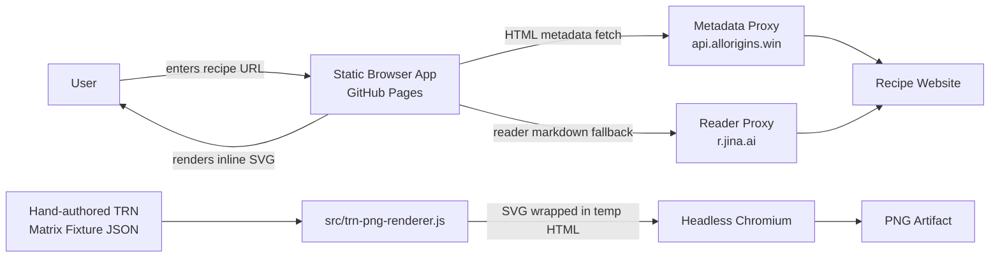
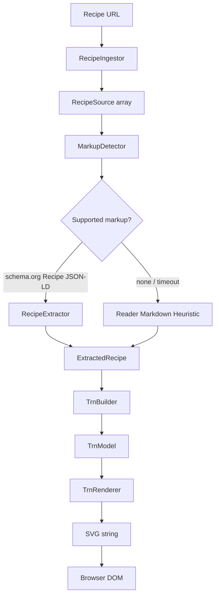
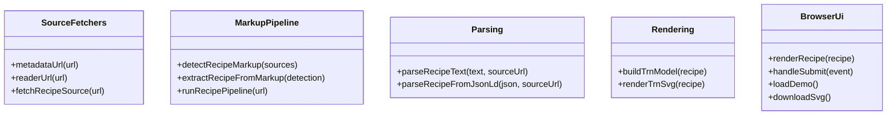
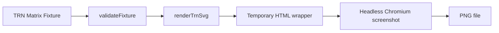

# Architecture

This document describes the current architecture of the Tabular Recipe Notation (TRN) prototype. It must stay aligned with code changes in the same commit whenever application structure, exported interfaces, parsing behavior, source-ingestion behavior, renderer behavior, model shape, or major data contracts change.

## Current working concept

The repository currently contains two working slices:

1. **Browser MVP** — a static GitHub Pages-compatible browser application in `src/app.js`. A user enters a recipe URL, the app ingests recipe sources through public CORS-friendly services, detects supported recipe markup, extracts recipe data, builds a browser TRN model, and renders inline SVG.
2. **Issue #11 PNG renderer** — a standalone fixture renderer in `src/trn-png-renderer.js`. It renders hand-authored TRN matrix fixtures to PNG so the team can validate the visual notation before adding recipe parsing/translation to the PNG generator.

## Technology alignment note

PR #16 / issue #11 is implemented in JavaScript with headless Chromium because it began before the Product Owner decision to standardize future backend rendering on Python Lambda/Pillow. That is acceptable for this first visual-slice PR, but it is not the long-term renderer implementation. Issue #17 is the approved next iteration and will port the same fixture contract and behavior to Python/Pillow so the canonical renderer can run locally and in AWS Lambda.

## Product direction

TRN is a grid-style recipe notation inspired by the Recipe Grid reference at <https://toddschiller.com/artifacts/recipe-grid/#p=brownies>.

For the PNG renderer contract:

- rows are ingredients,
- columns are actions/operations moving left-to-right,
- marks show ingredient participation in an action,
- optional spans show combined/intermediate preparations,
- the finished dish appears at the far right,
- superfluous recipe prose is removed,
- the output is a PNG review artifact.

## Runtime context



## Browser MVP pipeline



## Browser interface contracts

These are lightweight JavaScript object contracts, not TypeScript types.

### RecipeSource

```js
{
  kind: 'html' | 'reader-markdown',
  url: string,
  text: string
}
```

### MarkupDetection

```js
{
  standard: 'schema.org Recipe JSON-LD' | 'none',
  confidence: number,
  source: RecipeSource | null,
  parsedRecipe: ExtractedRecipe | null
}
```

### ExtractedRecipe

```js
{
  title: string,
  sourceUrl: string,
  basis: string,
  ingredients: string[],
  steps: string[],
  instructionSections: null | Array<{ text: string, section: string }>,
  prep: string,
  cook: string,
  total: string,
  servings: string
}
```

### Browser TrnModel

```js
{
  phases: string[],
  rows: Array<{
    ingredient: string,
    cells: Record<string, string[]>
  }>
}
```

Current limitation: the browser MVP model is not the Product Owner's target TRN matrix. The current backlog moves toward a PNG matrix generator where rows are ingredients and columns are actions.

## Browser implemented functions



## PNG renderer pipeline



## PNG renderer contract

The renderer consumes a TRN matrix fixture with this shape:

```js
{
  title: string,
  finalDish: string,
  rows: Array<{ id: string, label: string }>,
  columns: Array<{ id: string, label: string }>,
  spans?: Array<{
    id?: string,
    label?: string,
    rows: string[],
    fromColumn: string,
    toColumn: string
  }>,
  marks: Array<{ row: string, column: string }>
}
```

Ignored/superfluous fixture fields may exist for testing, but renderer output must not include them.

## PNG renderer module

`src/trn-png-renderer.js` exports:

```js
renderTrnSvg(fixture): string
renderTrnPngFile(fixture, outputPath): string
```

### `renderTrnSvg(fixture)`

- validates fixture references,
- renders ingredient rows on the left,
- renders action columns left-to-right,
- renders one consistent participation mark for each `marks[]` entry,
- renders optional combination spans for each `spans[]` entry,
- renders the finished dish column on the right,
- returns SVG markup.

The SVG includes `data-kind` attributes used by tests:

- `data-kind="ingredient-row"`,
- `data-kind="action-column"`,
- `data-kind="participation-mark"`,
- `data-kind="combination-span"`.

### `renderTrnPngFile(fixture, outputPath)`

- calls `renderTrnSvg(fixture)`,
- embeds the SVG in a temporary HTML document sized to the SVG viewbox,
- uses headless Chromium to screenshot the HTML/SVG into a PNG,
- writes the PNG to `outputPath`,
- returns the resolved output path.

## Commands

```bash
npm run check
npm run test:gherkin
npm run coverage:trn-renderer
npm run render:trn-fixture
npm run render:trn-tollhouse
npm run serve
```

Fixture rendering commands produce local review artifacts under:

```text
artifacts/
```

Generated PNG files are local review artifacts and are not committed.

## Testing strategy

`npm run check` runs:

- JavaScript syntax checks,
- existing app behavior tests,
- TRN PNG renderer unit/edge-case tests,
- executable Cucumber/Gherkin behavior tests under `tests/features/`,
- HTML sanity checks,
- JSON fixture sanity checks.

Issue #11's renderer tests verify:

- executable Gherkin scenarios bind to step definitions and render both fixture PNGs,
- a fixture can define ingredient rows, action columns, marks, spans, and final dish label,
- rendered SVG contains ingredient rows,
- rendered SVG contains action columns,
- rendered SVG contains participation marks,
- superfluous prose is absent from renderer output,
- PNG file generation produces a valid PNG with non-trivial size,
- validation rejects malformed fixture references,
- CLI success and usage-error paths are covered.

`npm run coverage:trn-renderer` measures coverage for `src/trn-png-renderer.js`.

## Known limitations

- The browser MVP still uses public CORS-friendly proxies and best-effort extraction.
- The browser MVP output is legacy SVG and does not yet use the new Product Owner-approved PNG matrix renderer.
- The issue #11 PNG renderer does not parse Schema.org JSON-LD.
- The issue #11 PNG renderer does not translate recipe steps into TRN rows/columns/marks.
- The issue #11 PNG renderer does not update the browser UI to render PNGs.
- Headless Chromium must be available on the machine running PNG generation.

Future issues will port rendering to Python/Pillow, add Lambda-shaped APIs, add AWS auth/deployment, add persistence, parse Schema.org recipes, translate normalized recipes to TRN matrices, and generate cached TRN PNGs from recipe URLs.
