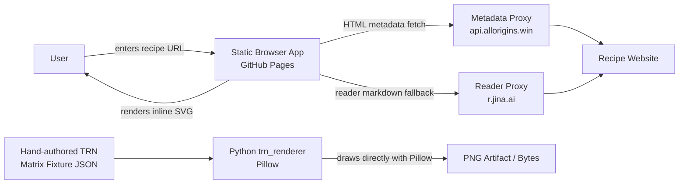
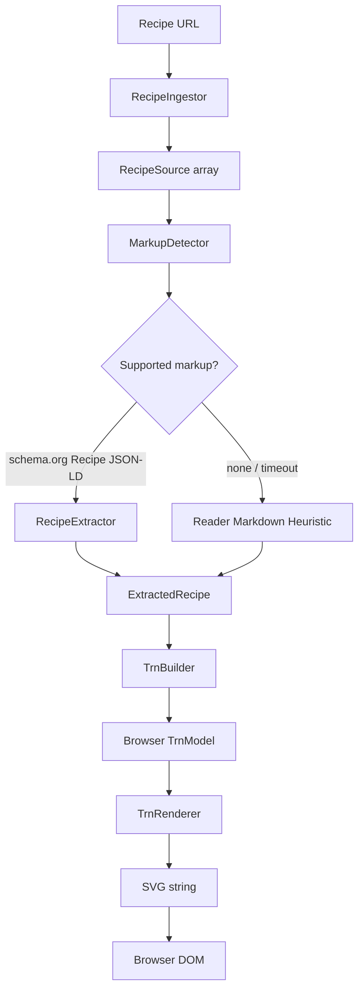
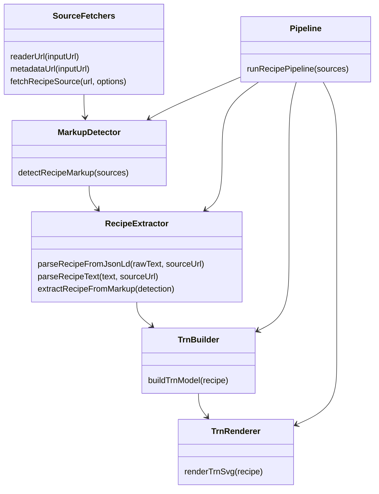
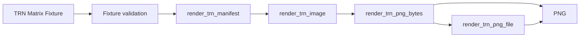
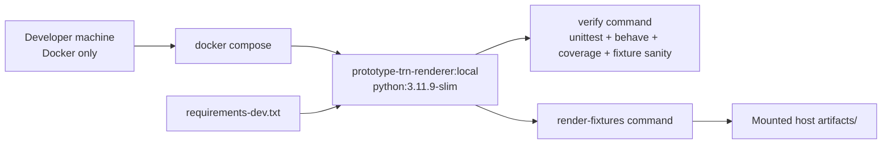

# Architecture

This document describes the current architecture of the Tabular Recipe Notation (TRN) prototype. It must stay aligned with code changes in the same commit whenever application structure, exported interfaces, parsing behavior, source-ingestion behavior, renderer behavior, model shape, or major data contracts change.

## Current working concept

The repository currently contains two working slices:

1. **Browser MVP** — a static GitHub Pages-compatible browser application in `src/app.js`. A user enters a recipe URL, the app ingests recipe sources through public CORS-friendly services, detects supported recipe markup, extracts recipe data, builds a browser TRN model, and renders inline SVG.
2. **Python PNG renderer** — a canonical Python/Pillow renderer in `trn_renderer/`. It renders hand-authored TRN matrix fixtures directly to PNG bytes/files without Chromium, a browser, a GUI, browser-side rendering, or cloud services.
3. **Local Docker renderer environment** — a pinned `python:3.11.9-slim` container that installs `fonts-dejavu-core` plus `requirements-dev.txt`, runs renderer verification, and generates PNG review artifacts into a mounted `artifacts/` directory without requiring host Python dependency installation.

## Product direction

TRN is a grid-style recipe notation inspired by the Recipe Grid reference at <https://toddschiller.com/artifacts/recipe-grid/#p=brownies>.

For the Python PNG renderer contract:

- rows are ingredients,
- columns are actions/operations moving left-to-right,
- marks show ingredient participation in an action,
- optional spans show combined/intermediate preparations,
- the finished dish appears at the far right,
- superfluous recipe prose is removed,
- the output is a PNG artifact.

## Runtime context



## Browser MVP pipeline



## Browser interface contracts

These are lightweight JavaScript object contracts, not TypeScript types.

### RecipeSource

```js
{
  kind: 'html' | 'reader-markdown',
  url: string,
  text: string
}
```

### MarkupDetection

```js
{
  standard: 'schema.org Recipe JSON-LD' | 'none',
  confidence: number,
  source: RecipeSource | null,
  parsedRecipe: ExtractedRecipe | null
}
```

### ExtractedRecipe

```js
{
  title: string,
  sourceUrl: string,
  basis: string,
  ingredients: string[],
  steps: string[],
  instructionSections: null | Array<{ text: string, section: string }>,
  prep: string,
  cook: string,
  total: string,
  servings: string
}
```

### Browser TrnModel

```js
{
  phases: string[],
  rows: Array<{
    ingredient: string,
    cells: Record<string, string[]>
  }>
}
```

Current limitation: the browser MVP model is not the Product Owner's target TRN matrix. The current backlog moves toward a PNG matrix generator where rows are ingredients and columns are actions.

## Browser implemented functions



## Python PNG renderer pipeline



## Docker renderer workflow



Docker files:

- `Dockerfile` pins the Python runtime, installs deterministic font assets, and installs repo-owned dependencies.
- `docker-compose.yml` defines the local `renderer` service and mounts `./artifacts:/app/artifacts`.
- `scripts/docker-renderer.sh` exposes `verify` and `render-fixtures` commands.

Docker commands:

```bash
npm run docker:build
npm run docker:check
npm run docker:render
```

The Docker workflow intentionally runs only the Python renderer verification path, not the existing static browser MVP. It exists so the renderer can be tested without host Python package installation and with a controlled Python version/dependency set.

## Python PNG renderer contract

The renderer consumes a TRN matrix fixture with this shape:

```js
{
  title: string,
  finalDish: string,
  rows: Array<{ id: string, label: string }>,
  columns: Array<{ id: string, label: string }>,
  spans?: Array<{
    id?: string,
    label?: string,
    rows: string[],
    fromColumn: string,
    toColumn: string
  }>,
  marks: Array<{ row: string, column: string }>
}
```

Ignored/superfluous fixture fields may exist for testing, but renderer output must not include them.

## Python PNG renderer module

`trn_renderer` exports:

```python
FixtureValidationError
render_trn_manifest(fixture) -> dict
render_trn_image(fixture) -> PIL.Image.Image
render_trn_png_bytes(fixture) -> bytes
render_trn_png_file(fixture, output_path) -> pathlib.Path
```

### `render_trn_manifest(fixture)`

- validates fixture structure and references,
- returns semantic render metadata for tests and future API metadata,
- includes title, final dish, ingredient rows, action columns, participation marks, combination spans, and rendered text,
- excludes superfluous fixture prose.

### `render_trn_image(fixture)`

- creates an RGB Pillow image,
- draws ingredient rows on the left,
- draws action columns left-to-right,
- draws one consistent participation mark for each `marks[]` entry,
- draws optional combination spans for each `spans[]` entry,
- draws the finished dish column on the right.

### `render_trn_png_bytes(fixture)`

- renders a Pillow image,
- serializes it to PNG bytes,
- returns bytes suitable for local commands and Docker-generated PNG artifacts.

### `render_trn_png_file(fixture, output_path)`

- renders PNG bytes,
- creates the output directory if needed,
- writes the PNG file,
- returns the resolved output path.

## Commands

```bash
npm run check
npm run coverage:trn-renderer
npm run render:trn-fixture
npm run render:trn-tollhouse
npm run docker:build
npm run docker:check
npm run docker:render
npm run serve
```

Fixture rendering commands produce local review artifacts under:

```text
artifacts/
```

Generated PNG files are local review artifacts and are not committed.

## Testing strategy

`npm run check` runs:

- JavaScript syntax checks for the existing browser MVP,
- existing browser app behavior tests,
- Python TRN PNG renderer unit/edge-case tests,
- executable Gherkin behavior tests with `behave`,
- HTML sanity checks,
- JSON fixture sanity checks,
- Docker configuration checks.

Issue #17's renderer tests verify:

- executable Gherkin scenarios bind to step definitions and render both fixture PNGs,
- a fixture can define ingredient rows, action columns, marks, spans, and final dish label,
- valid PNG bytes and files are produced,
- semantic manifest contains ingredient rows,
- semantic manifest contains action columns,
- semantic manifest contains participation marks and spans,
- semantic manifest contains the finished dish,
- superfluous prose is absent from renderer output,
- validation rejects malformed fixture references,
- CLI success and usage-error paths are covered.

`npm run coverage:trn-renderer` measures branch coverage for `trn_renderer/__init__.py` and enforces 100% for that renderer module.

## Known limitations

- The browser MVP still uses public CORS-friendly proxies and best-effort extraction.
- The browser MVP output is legacy SVG and does not yet use the Python PNG renderer.
- The Python PNG renderer does not parse Schema.org JSON-LD.
- The Python PNG renderer does not translate recipe steps into TRN rows/columns/marks.
- The Python PNG renderer is intentionally local/Docker-only in the current stack.

Future issues will add Schema.org parsing, normalized recipe to TRN matrix translation, and Docker URL-to-PNG generation first. Persistence, auth, and deployment are deferred until after the local Docker path is proven.

## Architecture alignment rule

Any PR that changes application structure, exported interfaces, parsing behavior, source-ingestion behavior, TRN model shape, rendering behavior, or major data contracts must update this document in the same commit as the code change.
