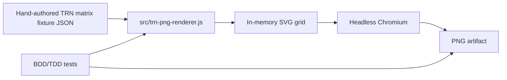

# Architecture

This document describes the current architecture of the Tabular Recipe Notation (TRN) prototype. It must stay aligned with code changes in the same commit whenever application structure, exported interfaces, parsing behavior, renderer behavior, model shape, or major data contracts change.

## Current working slice

Issue #11 establishes the first TRN PNG generator slice. It intentionally does **not** parse recipes yet. It renders a hand-authored TRN matrix fixture to a PNG file so the team can validate the visual language before adding recipe parsing and translation.

## Product direction

TRN is a grid-style recipe notation inspired by the Recipe Grid reference at <https://toddschiller.com/artifacts/recipe-grid/#p=brownies>.

For the current renderer contract:

- rows are ingredients,
- columns are actions/operations moving left-to-right,
- marks show ingredient participation in an action,
- the finished dish appears at the far right,
- superfluous recipe prose is removed,
- the output is a PNG review artifact.

## Runtime contexts



## Renderer contract

The renderer consumes a TRN matrix fixture with this shape:

```js
{
  title: string,
  finalDish: string,
  rows: Array<{ id: string, label: string }>,
  columns: Array<{ id: string, label: string }>,
  spans?: Array<{
    id?: string,
    label?: string,
    rows: string[],
    fromColumn: string,
    toColumn: string
  }>,
  marks: Array<{ row: string, column: string }>
}
```

Ignored/superfluous fixture fields may exist for testing, but renderer output must not include them.

## Renderer module

`src/trn-png-renderer.js` exports:

```js
renderTrnSvg(fixture): string
renderTrnPngFile(fixture, outputPath): string
```

### `renderTrnSvg(fixture)`

- validates fixture references,
- renders ingredient rows on the left,
- renders action columns left-to-right,
- renders one consistent participation mark for each `marks[]` entry,
- renders optional combination spans for each `spans[]` entry,
- renders the finished dish column on the right,
- returns SVG markup.

The SVG includes `data-kind` attributes used by tests:

- `data-kind="ingredient-row"`,
- `data-kind="action-column"`,
- `data-kind="participation-mark"`,
- `data-kind="combination-span"`.

### `renderTrnPngFile(fixture, outputPath)`

- calls `renderTrnSvg(fixture)`,
- embeds the SVG in a temporary HTML document sized to the SVG viewbox,
- uses headless Chromium to screenshot the HTML/SVG into a PNG,
- writes the PNG to `outputPath`,
- returns the resolved output path.

## CLI / app command

The first working application command is:

```bash
npm run render:trn-fixture
```

It renders hand-authored fixtures such as:

```text
tests/fixtures/hand-authored-trn-matrix.json
tests/fixtures/toll-house-cookie-trn-matrix.json
```

into local PNG artifacts under:

```text
artifacts/
```

Generated PNG files are local review artifacts and are not committed.

## Testing strategy

`npm run check` runs:

- JavaScript syntax checks,
- existing app behavior tests,
- TRN PNG renderer unit/edge-case tests,
- executable Cucumber/Gherkin behavior tests under `tests/features/`,
- HTML sanity checks,
- JSON fixture sanity checks.

Issue #11's renderer tests verify:

- executable Gherkin scenarios bind to step definitions and render both fixture PNGs,
- a fixture can define ingredient rows, action columns, marks, and final dish label,
- rendered SVG contains ingredient rows,
- rendered SVG contains action columns,
- rendered SVG contains participation marks,
- superfluous prose is absent from renderer output,
- PNG file generation produces a valid PNG with non-trivial size,
- validation rejects malformed fixture references,
- CLI success and usage-error paths are covered.

`npm run coverage:trn-renderer` measures coverage for `src/trn-png-renderer.js`.

## Known limitations

- This slice does not parse Schema.org JSON-LD.
- This slice does not translate recipe steps into TRN rows/columns/marks.
- This slice does not update the browser UI to render PNGs.
- Headless Chromium must be available on the machine running PNG generation.

Future issues will add Schema.org parsing, TRN matrix translation, and end-to-end URL-to-PNG generation.
