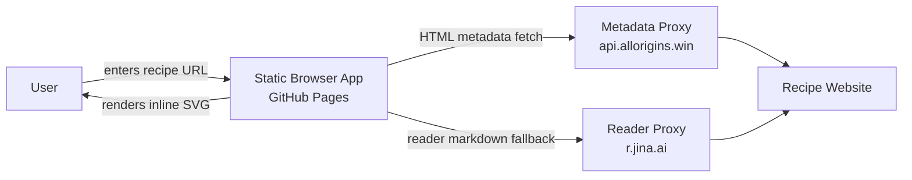
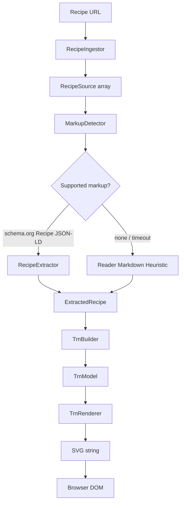
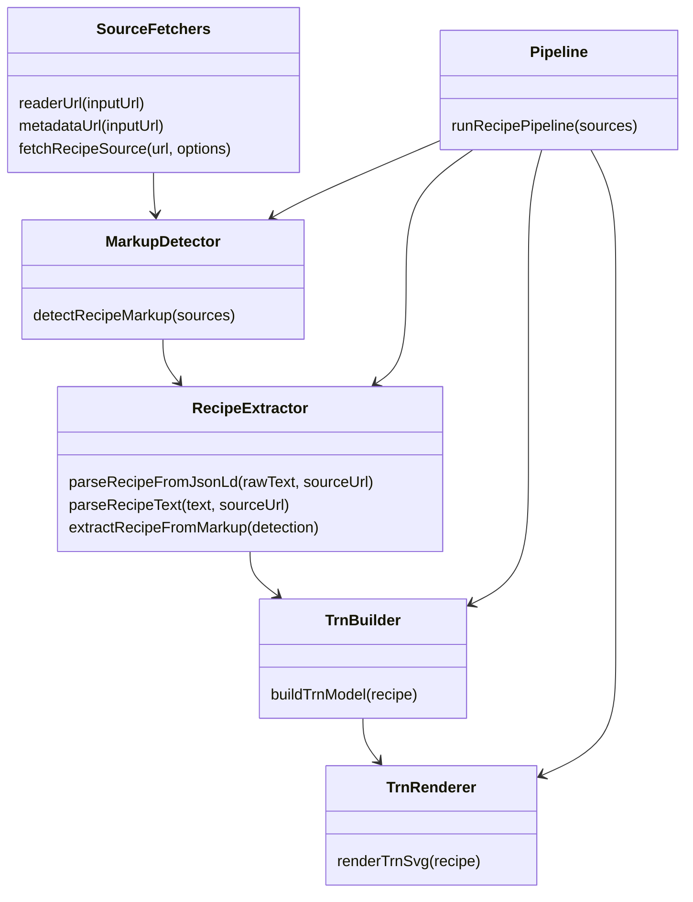
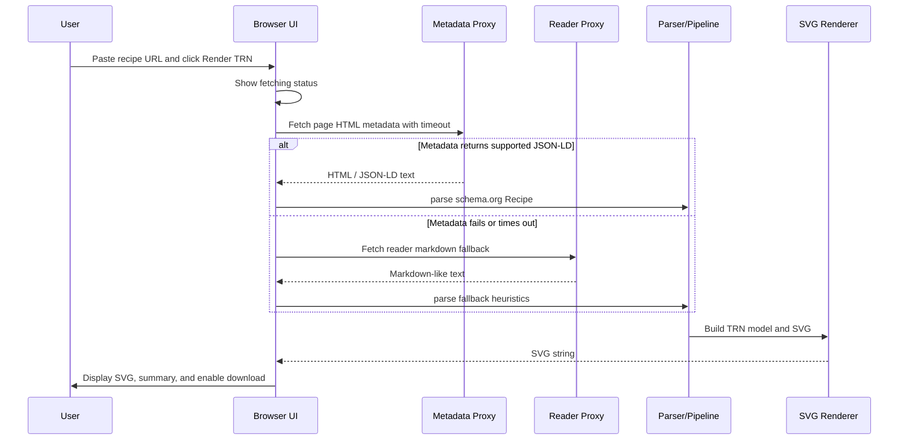

# Architecture

This document describes the current architecture of the Tabular Recipe Notation (TRN) prototype. It must stay aligned with code changes in the same commit whenever the application structure, interfaces, data model, fetch behavior, parser behavior, or renderer behavior changes.

## Current Working Concept

The app is a static GitHub Pages-compatible browser application. A user enters a recipe URL, the app ingests recipe sources through public CORS-friendly services, detects supported recipe markup, extracts a recipe, builds a TRN model, and renders the model as an inline SVG graphic.

The implementation currently lives in `src/app.js` with tests in `tests/app.test.js`. The architecture is intentionally small but now has explicit pipeline interfaces so each stage can be tested independently.

## Runtime Context



## Pipeline Overview



## Interface Contracts

These are lightweight JavaScript object contracts, not TypeScript types.

### RecipeSource

```js
{
  kind: 'html' | 'reader-markdown',
  url: string,
  text: string
}
```

### MarkupDetection

```js
{
  standard: 'schema.org Recipe JSON-LD' | 'none',
  confidence: number,
  source: RecipeSource | null,
  parsedRecipe: ExtractedRecipe | null
}
```

### ExtractedRecipe

```js
{
  title: string,
  sourceUrl: string,
  basis: string,
  ingredients: string[],
  steps: string[],
  instructionSections: null | Array<{ text: string, section: string }>,
  prep: string,
  cook: string,
  total: string,
  servings: string
}
```

### TrnModel

```js
{
  phases: string[],
  rows: Array<{
    ingredient: string,
    cells: Record<string, string[]>
  }>
}
```

Current limitation: `rows[].ingredient` may contain the synthetic `General method` row. Issue #5 tracks separating synthetic method rows from real ingredient rows.

## Implemented Functions



### Source fetchers

- `metadataUrl(inputUrl)` builds the CORS metadata proxy URL.
- `readerUrl(inputUrl)` builds the reader markdown fallback URL.
- `fetchRecipeSource(url, options)` tries metadata first with timeout; if metadata fails, hangs, or does not produce supported markup, it falls back to reader markdown.

### Markup detection

- `detectRecipeMarkup(sources)` scans provided sources for supported recipe markup.
- Current supported standard: schema.org `Recipe` JSON-LD.
- No markup returns `standard: 'none'` and `confidence: 0`.

### Extraction

- `parseRecipeFromJsonLd(rawText, sourceUrl)` parses `application/ld+json` script blocks or raw JSON-LD text, finds schema.org `Recipe` nodes, and extracts standardized fields.
- `extractRecipeFromMarkup(detection)` converts a successful detection into an `ExtractedRecipe`.
- `parseRecipeText(text, sourceUrl)` remains a compatibility helper. It tries JSON-LD first and then falls back to reader-markdown heuristics.

### TRN building

- `buildTrnModel(recipe)` turns an `ExtractedRecipe` into rows, phases, and cells.
- If `instructionSections` exists, phases are derived from source `HowToSection` names.
- If no structured sections exist, the fallback phases are `Prep`, `Cook`, and `Finish`.
- Unmatched structured steps currently go to a synthetic `General method` row.

### Rendering

- `renderTrnSvg(recipe)` builds a `TrnModel` and renders it as inline SVG.
- The browser stores the SVG for download.

## Form Submit Sequence



## Testing Strategy

Tests are no-dependency Node/Python checks run by:

```bash
npm run check
```

`tests/app.test.js` covers:

- demo recipe parsing,
- reader and metadata proxy URL helpers,
- Dining with Skyler reader fallback extraction,
- schema.org `Recipe` JSON-LD extraction,
- section-aware TRN phase generation,
- no-markup detection,
- pipeline output shape,
- metadata timeout fallback.

`tests/check_html.py` covers static HTML sanity: required DOM IDs and app script reference.

## Known Limitations

- Static deployment depends on public proxy services for cross-origin recipe access.
- Only schema.org `Recipe` JSON-LD is treated as a standardized markup source today.
- Reader markdown fallback is heuristic and can be incomplete.
- Ingredient/action relationship mapping is approximate; issue #5 tracks notation cleanup, method-row separation, and false-positive matching.
- There is no persistent storage or backend scraper.

## Architecture Alignment Rule

Any PR that changes application structure, exported interfaces, parsing behavior, source-ingestion behavior, TRN model shape, rendering behavior, or major data contracts must update this document in the same commit as the code change.
